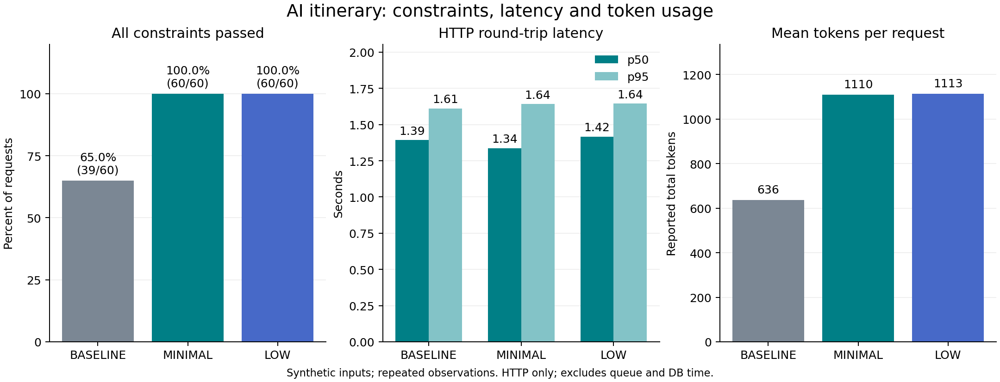

# AI 일정 시간 제약·응답 품질 실험 (#97)

## 관측 결과와 결정

2026-09-20(KST) 실행한 본 실험 180회는 모두 HTTP 200으로 종료했다.
시간·개수·장소 등 전체 제약을 통과한 비율은 baseline 65%에서 개선 조건 100%로 높아졌다.
속도와 취향 적합도가 전반적으로 개선됐다는 근거는 얻지 못했다.

| 조건 | 전체 제약 준수 | 평균 지연 | p50 | p95 | 총 토큰 |
| --- | ---: | ---: | ---: | ---: | ---: |
| baseline | 39/60 (65%) | 1,398.77ms | 1,393.72ms | 1,611.04ms | 38,152 |
| MINIMAL | 60/60 (100%) | 1,382.33ms | 1,337.34ms | 1,642.49ms | 66,580 |
| LOW | 60/60 (100%) | 1,411.82ms | 1,416.18ms | 1,644.50ms | 66,793 |



- baseline 실패는 여행 시간 범위 12건, 기존 일정 겹침 6건, 빈 일정 3건이었다.
  개선 조건에서는 이 표본의 위반이 없었다. 운영 환경에서의 무오류를 보장하는 결과는 아니다.
- MINIMAL은 baseline 대비 평균 지연이 약 1.2% 낮았지만 p95는 약 2.0% 높았다.
  이 차이만으로 속도 개선을 주장하지 않는다. 전체 토큰은 약 74.5% 증가했다.
- 선택한 후보의 MBTI 태그 적합률은 baseline 48.57%(85/175), MINIMAL 28.97%(42/145),
  LOW 28.67%(43/150)였다. 시간 제약 개선과 함께 취향 적합도 회귀가 관측되어 후속 검증이 필요하다.
  장소 수·직선 동선도 달라졌으므로 이를 실제 만족도 변화로 해석하지 않는다.
- LOW의 추가 제약 준수 이점은 관측되지 않았고 평균 지연도 MINIMAL보다 높았다.
  기본 추론은 `MINIMAL`로 유지한다. 이 결정은 제한된 합성 입력의 관측에 근거한다.
- 세 조건 모두 응답의 `thoughtsTokenCount`는 0이었다. 설정값은 요청에 기록됐지만,
  내부 추론량 차이를 이 지표로 입증할 수는 없었다.

구체적인 사례로 `fragmented-day`의 첫 반복은 09:00~20:00 사이에서 기존 약속 세 개를 피해야 한다.
baseline은 00:00부터 배치해 여행 범위를 위반했다(원시 결과 index 13).
MINIMAL은 09:00, 11:30, 15:00, 18:00에 배치해 허용 범위를 지켰다(index 91).
모든 결과의 평가를 다시 계산해 저장된 위반·거리·태그 지표와 일치함을 확인했다.

## 목적과 비교 범위

비공연일 AI 일정의 도착·출발 범위와 기존 일반 일정 충돌을 줄이는 변경을 검증한다.
운영 사용자의 개선 전후 측정이 아니라, 같은 합성 입력을 세 요청 조건에 전달한 비교다.
실제 사용자 데이터·실제 장소의 영업 정보·API 키는 결과 파일에 포함하지 않는다.

| 조건 | 요청 생성 방법 | 추론 설정 |
| --- | --- | --- |
| baseline | `6186bd1`의 프롬프트·JSON 스키마 재구성 | 지정하지 않음(해당 버전 동작) |
| minimal | 현재 Java 클라이언트가 만든 요청을 그대로 추출 | `MINIMAL` |
| low | minimal 요청의 추론 수준만 교체 | `LOW` |

baseline과 개선 조건은 시간 정보, 장소 맥락, 스키마 제약, 추론 설정이 함께 다르다.
따라서 개별 변경의 인과 효과는 분리할 수 없다. minimal과 low 비교에서는 추론 설정만 다르다.
후보 선정 점수나 DB 검색 성능은 이 실험에서 측정하지 않는다.
20개 baseline 요청은 해당 클라이언트 코드가 동일한 `45ae9eb` 체크아웃에서 직접 추출한 Java
요청과 JSON 객체 단위로 일치하는 것을 확인했다. 개선 요청도 현재 클라이언트 내보내기와 일치한다.

## 입력과 실행 설계

- [합성 시나리오](../../../tools/ai-evaluation/scenarios.json) 20개 × 조건 3개 × 반복 3회 = 180회.
- 도착일·출발일·당일 여행·분할된 시간대·기존 일정·미정 시각/체류시간·동행·취향·숙소 좌표 없음·
  후보 없음/소수 후보를 포함한다. 모든 사례는 비공연일이다.
- 세 조건에는 동일 후보 목록을 사용한다. baseline 입력에는 당시 코드처럼 기존 일반 일정이 빠진다.
- seed `97`로 전체 요청 순서를 섞고 순차 실행한다. API 샘플링 seed는 지정하지 않는다.
- HTTP 제한 시간 30초, 요청 종료 후 5초 간격, 실험 도구의 자동 재시도 없음.
  서비스의 일시 오류 재시도 성능은 이 실험 범위 밖이다.
- `requests.json`은 실제 요청 본문과 입력, `results.jsonl`은 요청별 시각·응답·토큰·시간·실패를 보존한다.
  `manifest.json`은 모델·반복 수·호출 간격·실행 시각을 기록한다.

## 결과 파일

- [본 실험 집계](paced-main/summary.md), [CSV](paced-main/summary.csv),
  [요청 원본](paced-main/requests.json), [응답 원본](paced-main/results.jsonl),
  [실행 메타데이터](paced-main/manifest.json).
- [파일럿](pilot/summary.md): 1개 입력 × 3조건, 연결·응답 형식 확인용이며 본 실험에서 제외한다.
- [중단한 첫 실행](main/summary.md): 0.25초 간격으로 실행하다 분당 15회 무료 티어 제한(HTTP 429)을
  확인해 52회에서 중단했다(HTTP 성공 29회, 실패 23회). 실패를 삭제하지 않고 별도로 보존한다.
  본 실험은 간격을 5초로 바꿔 새로 실행했다.

## 지표와 해석 한계

- API 성공은 HTTP 200이다. 전체 제약 준수는 정상 종료(`STOP`)와 파싱, 시간 범위·겹침·개수·
  체류시간·제목·후보 ID·장소 중복 검사를 모두 통과한 요청 수다.
- 종료 시각과 다음 시작이 같으면 허용한다. 기존 일정에 시각이 없으면 제외하고, 체류시간만 없으면
  시작 시점만 보호한다. `placeId=null`인 CUSTOM 일정은 허용한다.
- 지연은 Python HTTP 왕복과 본문 수신 시간이다. 큐 대기·애플리케이션 준비·DB 저장·알림·화면 반영은
  포함하지 않는다. 실패 요청도 기본 지연 집계에 포함한다. p95는 정렬 표본 사이 선형 보간이다.
- 태그 적합률은 선택한 후보 장소 중 여행 MBTI 대응 태그가 있는 비율이다. 동행 태그 적합도나
  사용자 만족도의 점수가 아니다. CUSTOM 항목은 분모에서 제외된다.
- 직선 경로는 숙소 기준점(있으면)에서 시간순으로 선택한 후보 장소를 잇는 거리다. CUSTOM 위치와
  마지막 숙소 복귀는 포함하지 않는다. 선택 장소 수에 영향을 받으므로 이동 효율 개선의 단독 근거로
  사용하지 않는다. 도로 이동시간·영업시간·현장 방문 가능성은 검증하지 않았다.
- 20개 입력의 반복 결과이므로 독립적인 실제 사용자 180명의 결과가 아니다. 모델 출력과 지연은
  반복마다 달라질 수 있다. 원시 결과와 실패를 함께 보존하며 만족도·운영 SLA 개선을 주장하지 않는다.

## 재현

저장소 루트에서 Java 요청 본문을 추출한다. 이 단계에서는 실제 Gemini API를 호출하지 않는다.

```sh
AI_EVALUATION_EXPORT=true bash gradlew test --tests '*GeminiEvaluationFixtureTest'
python3 -m unittest discover -s tools/ai-evaluation -p 'test_*.py'
```

`GEMINI_API_KEY`를 환경 변수에 제공하거나 저장소 밖의 환경 파일을 `--env-file`로 지정한다.
아래 명령은 실제 API를 호출하므로 프로젝트의 사용량 제한이 적용된다. 기존 결과 폴더는 덮어쓰지 않는다.

```sh
GEMINI_MODEL=gemini-3.5-flash-lite python3 tools/ai-evaluation/run.py \
  --output build/ai-evaluation/new-run --repeats 3 --seed 97 --delay-seconds 5
python3 tools/ai-evaluation/run.py \
  --output docs/experiments/ai-itinerary-97/paced-main --summarize
```

선택적으로 `matplotlib`이 설치된 Python에서 비교 그림을 다시 생성할 수 있다.

```sh
python3 tools/ai-evaluation/plot.py docs/experiments/ai-itinerary-97/paced-main
```

## 구현 검증

명령·건수·기준 브랜치 대조 결과는 [자동 검증 기록](validation.md)에 정리한다.

준비·모델 호출·검증/저장·전체 처리 시간은 서버 로그에서 별도로 측정한다.
기본 추론은 `GEMINI_THINKING_LEVEL=MINIMAL`로 유지한다.
시간·장소·스키마·정상 종료·사용 횟수 처리는 자동 테스트로 검증하며, DB 통합 테스트에는
모델 호출 중 커밋된 수동 일정의 충돌 거부와 경계 시각 허용을 포함한다.

기술 참조: [Gemini 구조화 출력](https://ai.google.dev/gemini-api/docs/structured-output),
[Gemini 추론 설정](https://ai.google.dev/gemini-api/docs/thinking).
