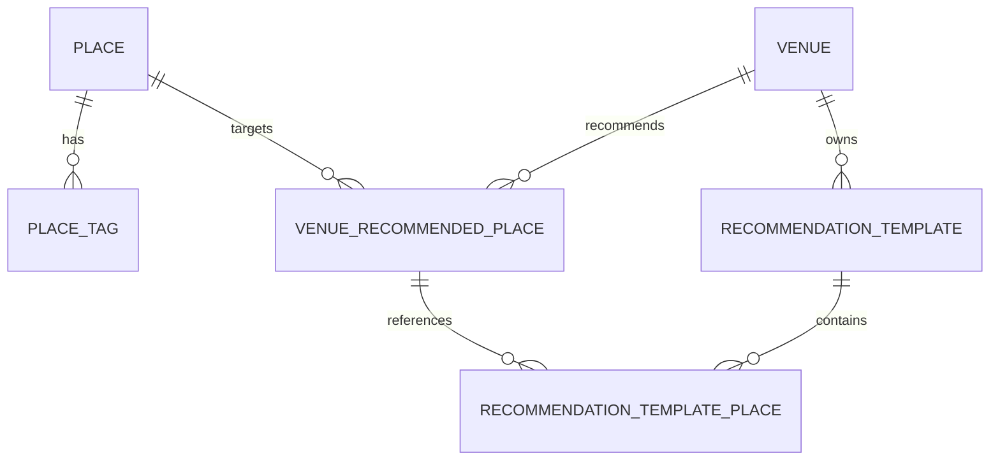

# 공연장 추천 장소와 추천 코스

## 목적

공연장 주변 장소를 관리자가 선별해 등록하고, 사용자가 공연 전후 일정에 선택해서
추가할 수 있도록 한다. 서버가 정기적으로 Gemini나 외부 장소 API를 호출해 추천 목록을
생성하지 않으며, 장소 등록은 관리자·운영 도구가 담당한다.

## 도메인 관계

- `Place`는 장소 자체의 정보와 성격을 가진다.
- `place_tags`의 태그는 `PlaceTag` enum으로 제한한다. 예: `FOOD`, `CAFE`, `PHOTO_SPOT`.
- `VenueRecommendedPlace`는 공연장과 장소의 관계다. 공연장별 추천 순서와 추천 시간대를
  저장하며, 같은 장소라도 공연장마다 다르게 등록할 수 있다.
- `RecommendationTemplate`은 “공연 전 식사 코스”, “공연 후 관광 코스”처럼 이름과 설명을
  가진 코스다.
- `RecommendationTemplatePlace`는 `Place`를 직접 참조하지 않고
  `VenueRecommendedPlace`를 참조한다. 따라서 코스에 포함된 항목도 공연장별 추천 정책과
  동일한 시간대·순서 정보를 재사용한다.

## 조회 정책

추천 장소와 코스 조회 시 `concertScheduleId`를 함께 전달할 수 있다.

1. 회차의 공연 시작 시각을 `MORNING`, `LUNCH`, `EVENING`, `NIGHT`로 변환한다.
2. 공연과 같은 시간대로 등록된 추천 장소·코스를 제외한다.
3. 시간대가 지정되지 않은 항목을 우선하고, 거리와 관리자가 지정한 순서를 적용한다.
4. 회차의 공연장이 요청한 공연장과 다르면 오류를 반환한다.

공연장 자체가 존재하지 않는 경우와 추천 결과가 비어 있는 경우를 구분한다. 추천 데이터가
없으면 빈 목록을 반환하고, 잘못된 공연장 ID는 오류로 처리한다.

## API 계약

기준 경로는 `/api/v1`이다.

| 대상 | 메서드와 경로 | 용도 |
| --- | --- | --- |
| 추천 장소 조회 | `GET /venues/{venueId}/recommended-places` | 사용자용 추천 장소 목록 |
| 추천 코스 조회 | `GET /venues/{venueId}/recommendation-templates` | 사용자용 코스 목록 |
| 추천 장소 등록 | `POST /admin/venue-recommended-places` | 관리자 단건 등록 |
| 추천 장소 벌크 등록 | `POST /admin/venue-recommended-places/import` | 로컬 운영 도구에서 여러 건 등록 |
| 추천 장소 수정·삭제 | `PUT/DELETE /admin/venue-recommended-places/{id}` | 관리자 관리 |
| 추천 코스 관리 | `POST/PUT/DELETE /admin/recommendation-templates` | 코스 생성·수정·삭제 |
| 코스 항목 관리 | `POST /admin/recommendation-templates/{templateId}/places` | 추천 장소를 코스에 추가 |
| 코스 항목 삭제 | `DELETE /admin/recommendation-templates/places/{templatePlaceId}` | 코스에서 항목 제거 |
| 일정에 추가 | `POST /itinerary-days/{dayId}/items/from-recommended-place` | 선택한 추천 장소를 일반 일정 항목으로 추가 |

조회 API의 선택적 쿼리 파라미터는 `concertScheduleId`다. 관리 API는 JWT 관리자 권한이
필요하다.

## 운영 방식과 비용 경계

- 운영자는 이미 동기화된 `Place`를 선택해 공연장별 추천 장소로 등록한다.
- 로컬에서 AI나 외부 API를 사용해 후보를 만들더라도, 원격 서버에는 검증된 장소 ID를
  벌크 등록 API로 전달한다.
- 벌크 등록은 단건 등록과 같은 검증을 거치며, 목록 중 하나라도 실패하면 전체 작업을
  롤백한다.
- `nearby-candidates`는 명시적으로 호출할 때만 외부 TourAPI를 사용하는 관리자 보조
  기능이다. 정기 배치나 사용자 조회 경로에서 자동 호출하지 않는다.
- 추천 장소를 일정에 추가한 뒤에는 공연 연결 고정 항목이 아니라 일반 일정 항목으로
  수정·삭제한다.

## 스키마 반영 확인

현재 애플리케이션은 `ddl-auto=update` 방식으로 개발 스키마를 갱신한다. 운영 반영 전
다음 테이블과 컬럼을 확인하고, 배포 정책에 맞는 버전 관리 마이그레이션으로 전환한다.

- `place_tags`
- `venue_recommended_places`
- `recommendation_templates`
- `recommendation_template_places`
- `trip_plans.concert_schedule_id`

회차 날짜가 여행 기간 안에 포함되는지 검증하는 정책과 API 통합 테스트는 후속 작업으로
확정한다.
