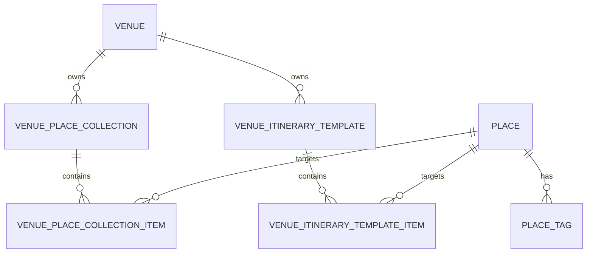

# 공연장 추천 장소와 장소 컬렉션

## 목적

공연장 주변 장소를 관리자가 카테고리별로 선별해 컬렉션으로 묶고, 사용자가 공연 전후
일정에 선택해서 추가할 수 있도록 한다. 서버가 정기적으로 Gemini나 외부 장소 API를
호출해 컬렉션을 생성하지 않으며, 장소와 컬렉션 등록은 관리자·운영 도구가 담당한다.

## 도메인 관계

- `Place`는 장소 자체의 정보와 성격을 가진다.
- `PlaceCategory`는 TourAPI 원천 유형을 나타낸다. 현재 `ACCOMMODATION(32)`, `ATTRACTION(12)`,
  `CULTURAL_FACILITY(14)`, `SHOPPING(38)`, `RESTAURANT(39)`을 사용한다.
- `place_tags`의 태그는 `PlaceTag` enum으로 제한한다. 카페는 `RESTAURANT` 안에서 `CAFE`, 공원은
  `ATTRACTION` 안에서 `PARK`처럼 장소의 세부 성격을 태그로 구분한다.
- `VenuePlaceCollection`은 공연장 주변 장소를 재사용 가능한 묶음으로 관리한다. 예를 들어
  `공연장 주변 추천 장소`, `공연 전 식사 후보`, `공연 후 관광 후보`처럼 구성할 수 있다.
- `VenuePlaceCollectionItem`은 컬렉션과 장소의 관계 및 노출 순서를 저장한다. 장소 자체를
  복제하지 않으며, 한 장소가 여러 공연장·컬렉션에 포함될 수 있다.
- `VenueItineraryTemplate`은 공연을 제외한 장소 일정 초안이다. 템플릿 항목에는 기본 시각과
  소요 시간을 둘 수 있으며, 사용자가 선택하면 일반 일정 항목으로 복사한다.

## 조회 정책

`GET /venues/{venueId}/place-collections`는 그 공연장에 등록된 컬렉션과 항목을 반환한다.
공연장 자체가 존재하지 않는 경우와 컬렉션이 없는 경우를 구분한다.

## API 계약

기준 경로는 `/api/v1`이다.

| 대상 | 메서드와 경로 | 용도 |
| --- | --- | --- |
| 공연장 목록 | `GET /venues` | 운영 도구·사용자용 공연장 목록 |
| 공연장 상세 | `GET /venues/{venueId}` | 공연장 기본 정보와 공연·추천 장소 개수 |
| 장소 컬렉션 조회 | `GET /venues/{venueId}/place-collections` | 공연장 주변 장소 묶음 조회 |
| 일정 템플릿 조회 | `GET /venues/{venueId}/itinerary-templates` | 공연장별 일정 초안 조회 |
| 내부 장소 동기화 | `POST /internal/places/sync` | 로컬 운영 도구에서 TourAPI 동기화 실행 |
| 내부 후보 조회 | `GET /internal/places/nearby-candidates` | 로컬 운영 도구에서 TourAPI 후보 조회 |
| 내부 장소 반영 | `POST /internal/places/import` | 검수한 후보를 `contentId` 기준으로 upsert하고 ID 반환 |
| 내부 장소 컬렉션 반영 | `POST /internal/venue-place-collections/import` | 로컬에서 구성한 컬렉션과 항목을 반영 |
| 내부 일정 템플릿 반영 | `POST /internal/venue-itinerary-templates/import` | 로컬 Gemini 결과를 템플릿으로 반영 |
| 일정에 추가 | `POST /itinerary-days/{dayId}/items/from-place` | 컬렉션에서 선택한 장소를 일반 일정 항목으로 추가 |
| 템플릿으로 일정 생성 | `POST /itinerary-days/{dayId}/items/from-template` | 템플릿 항목을 일반 일정 항목으로 복사 |

관리 API(`/admin/**`, `/internal/**`)는 JWT 관리자 권한이 필요하다.

## 운영 방식과 비용 경계

- 운영자는 이미 동기화된 `Place`를 카테고리별로 선정해 공연장 컬렉션으로 등록한다.
- 로컬에서 AI나 외부 API를 사용해 후보를 만들더라도, 원격 서버에는 검증된 장소 ID를
  벌크 등록 API로 전달한다.
- 카테고리별 후보 조회는 `RESTAURANT`, `CAFE`, `ATTRACTION`처럼 여러 번 실행한 뒤 로컬에서
  합쳐 검수한다.
- 컬렉션 반영은 같은 공연장·컬렉션 이름의 항목을 전체 교체하며, 목록 중 하나라도 실패하면
  전체 작업을 롤백한다.
- `nearby-candidates`는 명시적으로 호출할 때만 외부 TourAPI를 사용하는 관리자 보조
  기능이다. 새 로컬 운영 도구는 `/internal/places/nearby-candidates`를 사용하며, 정기 배치나
  사용자 조회 경로에서 자동 호출하지 않는다. 기존 `/admin/places/nearby-candidates`는
  프론트·운영 도구 호환을 위해 당분간 유지한다.
- 추천 장소를 일정에 추가한 뒤에는 공연 연결 고정 항목이 아니라 일반 일정 항목으로
  수정·삭제한다.

## 스키마 반영 확인

현재 애플리케이션은 `ddl-auto=update` 방식으로 개발 스키마를 갱신한다. 운영 반영 전
다음 테이블을 확인하고, 배포 정책에 맞는 버전 관리 마이그레이션으로 전환한다.

- `place_tags`
- `venue_place_collections`
- `venue_place_collection_items`
