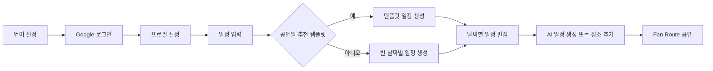

# 와이어프레임 기준

## 문서 범위

와이어프레임 Rev.3의 화면 흐름과 기능 정책을 텍스트로 보존한다. 화면 구성 자체가 아닌
백엔드 모델·API에 영향을 주는 규칙을 우선 기록한다. 현재 프론트 프로토타입은
<https://sparkling-alfajores-f44fd5.netlify.app/>에서 확인한다.

## 전체 흐름

1. 언어 설정 → 소셜 로그인 → 프로필 초기 설정
2. 메인 진입
3. 일정 입력: 부산 도착·출발 일시와 관람 공연 선택
4. 공연일 추천 템플릿 사용 여부 선택
5. 일정 생성 완료 후 날짜별 일정 편집
6. 필요 시 AI 일정 생성
7. Fan Route 공유

Mermaid는 화면 간 흐름을 빠르게 검토하기 위한 보조 자료다. 세부 레이아웃과 상태는
와이어프레임 원본 또는 프론트 프로토타입을 기준으로 한다.

로그인하지 않은 사용자는 탭을 통해 서비스 기능에 진입할 수 없다. MVP는 한국어와 Google
OAuth만 지원한다.

## 일정 생성과 편집

- 일정 생성 단계에는 숙박 정보와 여행 스타일을 포함하지 않는다.
- 숙박 정보, 여행 스타일, 메모는 여행 상세 상단 메뉴에서 생성 후 별도로 입력한다.
- 추천 템플릿을 선택하면 공연일 일정 항목을 자동 생성한다.
- 추천하지 않으면 빈 날짜별 일정으로 편집 화면에 진입한다.
- 공연일 카드는 고정이며 수정·삭제할 수 없다. 일반 장소와 사용자 입력 일정은 수정·삭제할 수 있다.
- TourAPI 장소 검색은 인기순 또는 이전 일정 기준 거리순을 지원한다.
- AI 일정 생성은 날짜 1건 단위다. 생성 실패는 AI 사용 횟수에 포함하지 않는다.
- 사용자는 AI 추천 5회를 누적해 사용할 수 있다. AI 사용 횟수는 사용자 단위이며 서버만
  예약·확정·해제한다.

## 커뮤니티와 마이페이지

- Fan Route는 정보 공유, 참고 루트, 동행 모집 유형으로 구성한다.
- 참고 루트는 저장한 일정을 선택해 공유하고 텍스트 복사로 가져온다.
- 게시글은 좋아요와 한 단계 답글을 지원한다.
- 마이페이지는 프로필, 활동 내역, AI 루트 사용 현황을 제공한다.
- 알림 설정과 회원 탈퇴는 Phase 2 범위다.
