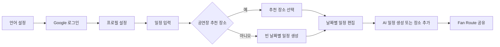

# 와이어프레임 기준

## 문서 범위

와이어프레임 Rev.3의 화면 흐름과 기능 정책을 텍스트로 보존한다. 화면 구성 자체가 아닌
백엔드 모델·API에 영향을 주는 규칙을 우선 기록한다. 현재 프론트 프로토타입은
<https://sparkling-alfajores-f44fd5.netlify.app/>에서 확인한다.

## 전체 흐름

1. 언어 설정 → 소셜 로그인 → 프로필 초기 설정
2. 메인 진입
3. 일정 입력: 부산 도착·출발 일시와 관람 공연 선택
4. 공연장 추천 장소 사용 여부 선택
5. 일정 생성 완료 후 날짜별 일정 편집
6. 필요 시 AI 일정 생성
7. Fan Route 공유

Mermaid는 화면 간 흐름을 빠르게 검토하기 위한 보조 자료다. 세부 레이아웃과 상태는
와이어프레임 원본 또는 프론트 프로토타입을 기준으로 한다.

로그인하지 않은 사용자는 탭을 통해 서비스 기능에 진입할 수 없다. MVP는 한국어와 Google
OAuth만 지원한다.

## 일정 생성과 편집

- 일정 생성 단계에는 숙박 정보와 여행 스타일을 포함하지 않는다.
- 숙박 정보, 여행 스타일, 메모는 여행 상세 상단 메뉴에서 생성 후 별도로 입력한다.
- 공연장 추천 장소 중 원하는 장소를 골라 사용자가 지정한 시각으로 일정에 추가한다.
- 추천하지 않으면 빈 날짜별 일정으로 편집 화면에 진입한다.
- 공연일 카드는 고정이며 수정·삭제할 수 없다. 일반 장소와 사용자 입력 일정은 수정·삭제할 수 있다.
- TourAPI 장소 검색은 인기순 또는 이전 일정 기준 거리순을 지원한다.
- AI 일정 생성은 날짜 1건 단위다. 생성 실패는 AI 사용 횟수에 포함하지 않는다.
- 공연이 연결된 여행의 AI 생성은 해당 공연장 장소 컬렉션에서 서버가 최대 8개 후보를 고른 뒤
  한 번만 호출한다. 후보가 없으면 임의 장소를 생성하지 않고 실패로 표시한다. 이 내부 처리 단계는
  사용자 API 계약을 바꾸지 않는다.
- 사용자는 AI 추천 5회를 누적해 사용할 수 있다. AI 사용 횟수는 사용자 단위이며 서버만
  예약·확정·해제한다.

## 커뮤니티와 마이페이지

- Fan Route는 정보 공유, 참고 루트, 동행 모집 유형으로 구성한다.
- 참고 루트는 저장한 일정을 선택해 공유하고 텍스트 복사로 가져온다.
- 게시글은 좋아요와 한 단계 답글을 지원한다.
- 마이페이지는 프로필, 활동 내역, AI 루트 사용 현황을 제공한다.
- 알림 설정과 회원 탈퇴는 Phase 2 범위다. 다만 동행 채팅의 새 메시지는 인앱 알림으로
  저장하며, 사용자가 등록한 FCM 디바이스 토큰에는 푸시 알림을 보낸다.

## 알림 API

모든 경로는 JWT 인증이 필요하다. 알림은 수신자별로 저장되며, 채팅 메시지를 보낸
사용자에게는 자기 메시지 알림을 만들지 않는다.

| 동작 | 메서드와 경로 | 주요 입력 |
| --- | --- | --- |
| 알림 목록·미읽음 수 | `GET /api/v1/notifications` | `size` |
| 읽음 처리 | `PATCH /api/v1/notifications/{notificationId}/read` | - |
| FCM 토큰 등록 | `POST /api/v1/notifications/push-tokens` | `token` |
| FCM 토큰 해제 | `DELETE /api/v1/notifications/push-tokens` | `token` |
| 실시간 인앱 수신 | STOMP `/user/queue/notifications` | - |

## Fan Route 커뮤니티 MVP API

- 게시글 목록은 검색어(제목·공연명·공연장명·태그), 유형, 지역 필터를 지원한다. 기본 정렬은 최신순이며 인기순은 좋아요 수 기준이다.
- 정보 공유는 본문을 입력한다. 참고 루트는 본인 저장 일정을 선택하여 게시 시점의 일정을 복사용 텍스트로 저장한다. 동행 모집은 공연·날짜·모집 정원을 입력한다.
- 동행 모집은 작성자별 활성 글 하나만 허용한다. 게시글을 만들 때 동행 채팅방도 함께
  생성하고 작성자는 방장으로 참여한다. 최상위 댓글 작성자는 게시글 작성자가 채택해야만
  채팅방에 참여할 수 있으며, 현재 인원은 활성 채팅방 참여자 수로 표시한다.
- 채팅방 목록·메시지 이력·읽음 처리는 REST로 제공하고, 새 텍스트 메시지는 인증된 활성
  참여자에게만 WebSocket(STOMP)으로 전달한다. 메시지 전송·구독은 참여자만 가능하다.
- 게시글 및 댓글은 좋아요를 지원한다. 답글의 답글은 최상위 댓글에 연결하여 한 단계 깊이로 노출한다. 삭제 시 하위 좋아요와 답글을 함께 제거한다.

### API 계약

모든 경로는 JWT 인증이 필요하며 기준 경로는 `/api/v1/community/posts`다.

| 동작 | 메서드와 경로 | 주요 입력 |
| --- | --- | --- |
| 목록 | `GET /` | `type=INFO/ROUTE/COMPANION`, `query`, `region`, `sort=latest/popular`, `page`, `size` |
| 상세·댓글 | `GET /{postId}` | - |
| 작성 | `POST /` | `type`, `title`, `content`(정보), `tags`, `tripPlanId`(참고 루트), `concertId`·`companionDate`·`capacity`(동행) |
| 삭제 | `DELETE /{postId}` | 작성자만 가능 |
| 게시글 좋아요·취소 | `PUT`, `DELETE /{postId}/like` | - |
| 댓글·답글 | `POST /{postId}/comments` | `content`, 선택 `parentId` |
| 댓글 삭제 | `DELETE /{postId}/comments/{commentId}` | 작성자만 가능 |
| 댓글 좋아요·취소 | `PUT`, `DELETE /{postId}/comments/{commentId}/like` | - |

## 동행 채팅 API

모든 경로와 STOMP 연결은 JWT 인증이 필요하다. 동행 게시글 생성 시 채팅방이 자동 생성되며,
방장은 해당 게시글의 최상위 댓글 작성자를 채택할 수 있다.

| 동작 | 메서드와 경로 | 주요 입력 |
| --- | --- | --- |
| 채팅방 목록 | `GET /api/v1/chat/rooms` | - |
| 메시지 이력 | `GET /api/v1/chat/rooms/{roomId}/messages` | `beforeMessageId`, `size` |
| 댓글 작성자 채택 | `POST /api/v1/chat/rooms/{roomId}/members` | `commentId` |
| 읽음 처리 | `PATCH /api/v1/chat/rooms/{roomId}/read` | `lastReadMessageId` |
| 실시간 전송 | STOMP `/app/chat.rooms/{roomId}/messages` | `content` |
| 실시간 수신 | STOMP `/user/queue/chat.rooms/{roomId}` | - |
| 실시간 읽음 상태 수신 | STOMP `/user/queue/chat.rooms/{roomId}/reads` | `userId`, `lastReadMessageId` |

목록/상세 응답의 `content`는 참고 루트에서 게시 당시 일정의 복사용 텍스트다. 동행 모집 응답의 `currentMembers`는 활성 채팅방 참여자 수다. 게시글 목록·상세와 댓글 응답의 `likedByMe`는 현재 JWT 사용자 기준 좋아요 여부로, 새로고침 후 버튼 상태 복원에 사용한다.
